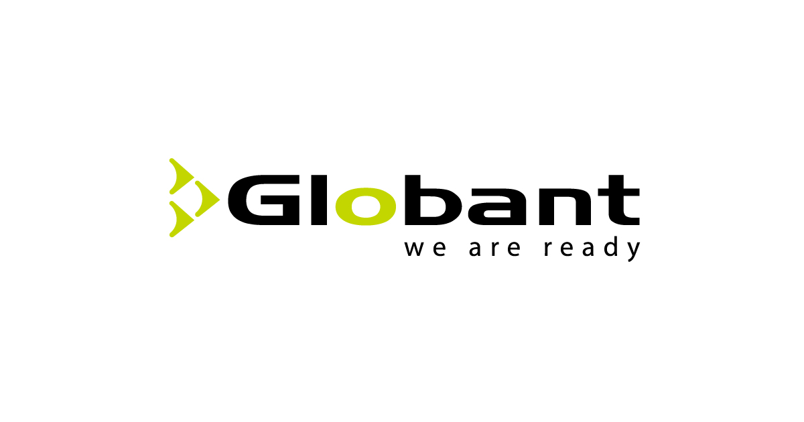

# Academy - Node.Js

# Importante
- Coordinador
  - Luca Sartori -> luca.sartori@globant.com
- Slack channel
  - falta crearlo
- Tutores
  - Marquez German -> german.marquez@globant.com
  - Nicolás Herrera -> nicolas.herrera@globant.com

## Objectivo
Aprender los conceptos básico para poder desarrollar APIs RESTFul en Nodejs

## Precondiciones
Tener conocimientos básico de javascript, GIT, OOP.

## Modalidad
Virtual con cheeckpoints día por medio para hacer un seguimiento del progreso. Los cheeckpoint serán grupales por hangout y se enviarán los invites por el mail de globant.

## Duración
El tiempo asignado al academy es de 2 semanas (10 días hábiles)

## Material
Usaremos cursos de udemy para gran parte de los contenidos del academy. Por otro lado complemetaremos algunos temas con material de lectura.

## ROAD MAP
| Fecha      | Descripción |
| --------- | -----|
| 08/05  | <b>Kick off / Comunication / repositories</b> |
| 09/05  | Setting the environment / start with REST & Express |
| 10/05  | <b>Cheeckpoint (Base/REST/Express)</b> |
| <s>11/05</s>  | <s>Weekend</s> |
| <s>12/05</s>  | <s>Weekend</s> |
| 13/05  | <b>Cheeckpoint / start with Asinc</b> |
| 14/05  | Start with Sequelize |
| 15/05  | <b>Cheeckpoint (asinc/sequelize)</b> |
| 16/05  | Start with JWT/TEST |
| 17/05  | <b>Cheeckpoint (jwt/test)</b> |
| <s>18/05</s>  | <s>Weekend</s> |
| <s>19/05</s>  | <s>Weekend</s> |
| 20/05  | <b>Cheeckpoint</b> |
| 21/05  | Code |
| 22/05  | <b>Final cheeckpoint</b> |
| 23/05  | Review |
